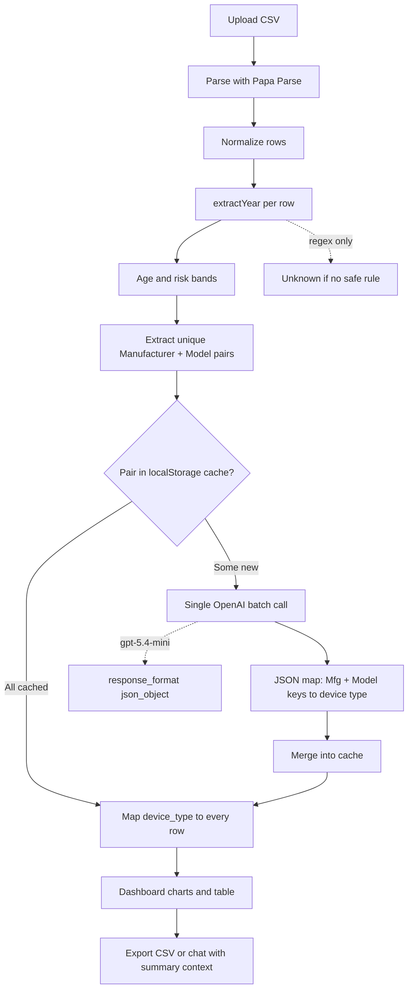

# Equiply Final Challenge

## Youtube Video: https://youtu.be/PKnvYGwbDjM

## Data processing Report: https://drive.google.com/file/d/1fJbMwyTsH9TjNMlvzyoTjFqyfkigSGms/view?usp=sharing

A small React app that enriches hospital equipment CSVs: pull manufacturing years from serial numbers with vendor-specific regex, classify device types with one batched OpenAI call, and explore the results on a dashboard. Built against `challenge_data-v1.csv` (801 rows, 55 unique manufacturer/model pairs).

## Pipeline flow



Dates never go through OpenAI. Device types never use per-row API calls.

## Setup

You need Node 18+ and an OpenAI key (the app uses `gpt-5.4-mini`, with fallback to `gpt-4o-mini`).

```bash
npm install
cp .env.example .env.local
```

Put your key in `.env.local` — do not commit that file:

```env
OPENAI_API_KEY=sk-your-key-here
```

Vite proxies `/api/openai` to OpenAI and attaches the key on the server, so it never ends up in the client bundle.

```bash
npm run dev
```

Open the URL Vite prints (usually `http://localhost:5173`) and upload a CSV with `manufacturer`, `model`, and `serial number` (or `serial_number`).

## Using the app

Upload a file and the app does two things in sequence.

First, it runs local regex on every row for manufacture year, age (vs 2026), and risk (Red over 10 years, Yellow 5–10, Green under 5). That part needs no API.

Second, it deduplicates manufacturer + model pairs, checks a `localStorage` cache, and sends only new pairs to OpenAI in a single JSON request. The response is a dictionary keyed like `ZOLL Medical | M SERIES` → device type, which gets mapped back onto all rows. Uploading the same file again should hit the cache and skip the API call.

The dashboard has risk and year charts, a device-type pie with a hover-linked legend, manufacturer counts, and a full table. The experimental toggle shows month/day in the UI where we have extra parsers (export still uses year only). The chatbot answers questions from a short summary of the dashboard, not the whole CSV.

Export gives five columns: `manufacturer`, `model`, `serial_number`, `manufactured_date` (year or `Unknown`), `device_type`.

## Why I built it this way

**Hybrid extraction for dates.** Manufacture years come from deterministic regex, not the LLM. Compliance work needs repeatable rules — same serial, same year. When a format is unclear (Olympus, unverified Mindray lines, Welch SURETEMPPLUS), the code returns `Unknown` instead of guessing. A wrong year is worse than no year.

**Unique batch mapping for device types.** Labels like "Patient Monitor" are a good fit for AI, but calling the API once per row on 801 lines is slow, expensive, and rate-limit prone. The dataset only has 55 unique pairs, so one prompt classifies all of them and we remap in memory. Cached pairs in `localStorage` mean repeat uploads are effectively free.

**Lightweight chat.** The assistant gets totals, risk breakdown, top manufacturers, device types, and known vs unknown year counts — enough context to answer normal questions without shipping 801 rows of tokens every time.

## How manufacture years are parsed

All logic lives in `src/lib/extractYear.js`. Serials are uppercased and stripped of spaces, hyphens, and parentheses before matching. Philips and Mindray also need the `model` column because one brand can use different schemes.

**Philips** — `DE` plus the next digit maps to a year (5→2005 through 8→2008; 3/4 for MX500). MX40 without `DE` uses the first digit (2→2012, 3→2013). Bare serials like `82061692` use the leading digit when there is no `DE`.

**GE Healthcare** — Three families: APEX `RT*` / `RTS*` with two-digit year after the prefix; PDM units `SA3YY…` and `SPXYY…`. The RT-only rule missed most PDM rows until SA3 and SPX were added.

**ZOLL** — Letters then two-digit year; optional leading digits (`3T13…`, `AF23…`).

**Hill-Rom** — Four-digit year at the end of the serial, or letter + two digits at the start.

**Edan / Masimo** — `M` or `K` followed by two year digits somewhere in the serial.

**Stryker / Linet** — Serial starts with `20` → use first four digits as year.

**Baxter Spectrum IQ** — Leading `37` / `38` style prefixes map to 2017 / 2018.

**ARJO Flowtron** — `21` prefix, year in the next segment (`2100053978` → 2005).

**Olympus CV190** — `75` prefix then two digits; special handling for the `50` → 2010 style codes in this file.

**Mindray ePM12MA** — `AH9` then `2` or `3` for 2022 / 2023. BeneVision N15 is left unknown (format not verified).

**Others** — Jiangmen `WU20YY`, Unico embedded `20YY`, Cogentix `CSYY`, Covidien `VLYY`, Thermo/Lab Corp/Biosonic two-digit prefix with century logic, Hospira same without optional `C`, American Diagnostic optional `C` + two digits, Exergen `20YY` or `AYY`, Welch `20YY` / `AYY` except SURETEMPPLUS (no pattern).

## What stayed unknown

On the challenge file, only **13 rows** are intentionally left without a year:

- **Mindray BeneVision N15** (7) — serial format flagged unverified
- **Welch Allyn SURETEMPPLUS** (6) — numeric serials with no stable rule

Those rows still get a `device_type` from the batch classifier. A handful of other edge serials (one Stryker, a few Hill-Rom, etc.) may still show `Unknown` until someone validates the OEM docs.

## Project layout

```
src/lib/extractYear.js       — date regex
src/lib/deviceTypeCache.js   — localStorage cache
src/services/openai.js       — batch classify + chat
src/App.jsx                  — UI and pipeline
src/components/              — chat, pie chart
```

Stack: React, Vite, Tailwind, Papa Parse, Recharts, OpenAI via proxy.

Keep API keys in `.env.local` only. For production you would move the proxy to a real backend.
